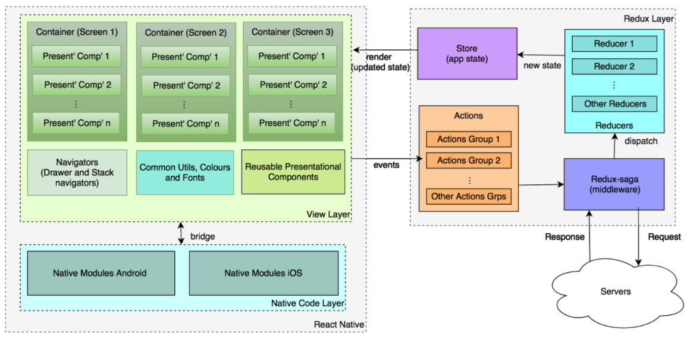
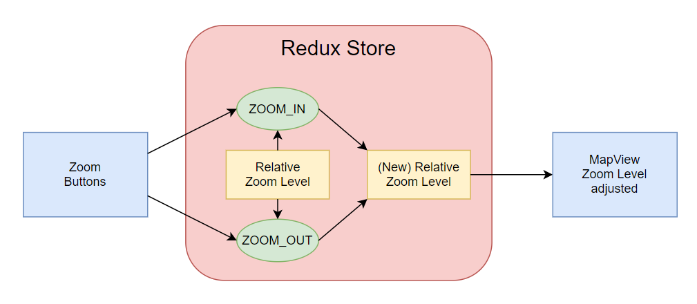

# Developer Guide
First, make sure you have React Native installed. If you have not yet set it up, please refer to the following: https://reactnative.dev/docs/environment-setup. After you have finished setting up, please look at the [TODO List](TODO.md) for action items to tackle. For more information on specific technical stuff, see the docs in the 'technical-docs' folder.

## Project Setup
1. Clone this repository
2. Run `npm install` in the root directory to generate `node_modules`
3. Create a `secrets.js` file in `src/containers/FeedbackForm`, which should declare the following Google Sheets info (please retrieve these from our Team Google Drive):
    - spreadsheetId
    - accountId
    - accountName
    - keyId
    - key

## Android Devices
4. From the root directory, run `chmod 755 android/gradlew` (user can read/write/execute).
    - Make sure the gradlew file has Unix format line endings (if using Mac). If not, run `dos2unix gradlew`.
    - Run `./gradlew clean` where gradlew is located.
5. Open `android` in Android studio and let Gradle build, OR type `./gradlew build` while in the 'android' folder.
    - You may need to first open and run the emulator.
    - If you are having trouble running an Android emulator, please refer to this: https://developer.android.com/studio/run/emulator-troubleshooting 
    - Tools > AVD Manager > Press the green triangle Play button next to your installed emulated device.
6.  To run the app, run the following command in the **root directory**: `npx react-native run-android` or `npm run android`
7.  If at any point you run into a message mentioning ./gradlew debug error or a server 500 error on the app relating to a dependency, follow the above steps again.
8.  To do the above steps as a shortcut, run ./setup.sh in the home directory

## iOS Devices
Note: You will need to have Xcode to build for iOS, which means you need to run it on macOS. If you are on Windows, install a macOS virtual machine, see [this guide](https://blog.udemy.com/xcode-on-windows/).

1. Navigate to the ios directory.
2. Run `pod install` to install dependencies from the Podfile. This will generate a 'Pods' directory.
3. Navigate back to the **root directory** and run either `npx react-native run-ios` or `npm run ios`.
    - If it complains about the Metro Bundler not running, run `npm start` or `react-native start` first.

## Running the app on a specific device
- Android: `react-native run-android --deviceId=DEVICE_ID`
  - For list of connected devices' IDs, run `adb devices` with android command line tools installed.
- iOS: react-native run-ios
  - For simulator, attach simulator tag: `--simulator="iPhone SE (1st generation)"`
    - `xcrun simctl list devices` to see all installed simulators
  - For physical device, attach device tag, for example: `--device "Jay's iPhone"`

## Link dependencies to native projects
Some libraries have dependencies that need to be linked in the native code generated for React Native. If something doesn’t work after you installed a new library, run `react-native link [LIBRARY-NAME]`. See the [official docs](https://reactnative.dev/docs/linking-libraries-ios) for more details on linking.

# Architecture
A React Native app is a compiled app that is running some Javascript. Metro is a 'bundler' that combines all your JS code into a one file and converts assets (ex: images) into objects that can be displayed by an Image components. 

Our app uses Redux, a predictable state container/management for JavaScript applications. The important pieces in our codebase to look at are: `src/reducers` and `src/actions`.

## Example: Simplified diagram of Zoom State
A user taps a Zoom button, which triggers a dispatch() event of either type ZOOM_IN/OUT defined in `src/actions`, which then
gets sent to `src/reducers/mapInteraction.js` > mapReducer() which handles changing the state's zoomLevel to +1 or -1.
- Finally, this change gets reflected in the MapView.
- Zoom levels can be between 10 and 20, which is handles in `src/components/organisms/MapView/index.js` > zoomPress().
