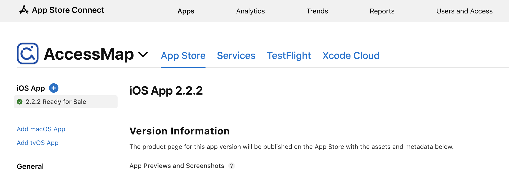

# Publishing to the Android Play Store

1. First, open the `android` folder of the app in Android Studio and let the app finish building
2. Build -> Build Bundle(s) / APK -> Build APK
3. Clean Project or do ./gradlew clean and let the APK finish building
4. Build -> Generate Signed Bundle/APK
5. Request the upload-keystore file from AccessMap devs, as well as the passwords, and set those as the keystore
   1. The keystore passwords can be found on the Accessmap Google Drive.
6. Go to Google Play Console and sign in with team credentials
7. Click next, submit, and let the signed APK finish building
8. The result can be found in `/android/app/release/`.
9. Drag and drop the .aab file into the Bundle Explorer and wait for it to be validated
   1.  If it complains about the version number already existing, go back to Android Studio and search for `versionCode` and increment it by some number and reupload.
   2.  If you have not published the app with that versionCode, you can still remove it from the Bundle Explorer.
10. If you are only pushing to a testing population, use Open Testing and select the uploaded file there.
11. If pushing to production (visible on public Play Store):
    1. Check the Pre-release report (in the left column) for any errors or accessibility problems.
    2. Submit app description and link to new privacy policy (if needed)
    3. Add new images (if needed) 

# Publishing to the Apple Store

1. Sign in to Apple Store Connect (Contact uwtcat@uw.edu for Team Access). The page will look something like above.
2. If there is a warning about an updated contract, the Account Holder must agree to the new contract in the **Agreements Tab** on the top right (Tax, and Banking module) to submit apps to the store.
3. Open Xcode
4. Update `PRODUCT_BUNDLE_IDENTIFIER` under Project Targets
5. Change Run settings from **Debug to Release**

6. Product > Archive (this will take a while)
   1. A window should pop up called 'Archives' (you can access this anytime under Window > Organizer)
7. Click Distribute App > App Store Connect > Upload (keep pressing Next...)

Helpful resources
- https://readybytes.in/blog/how-to-deploy-a-react-native-ios-app-on-the-app-store 