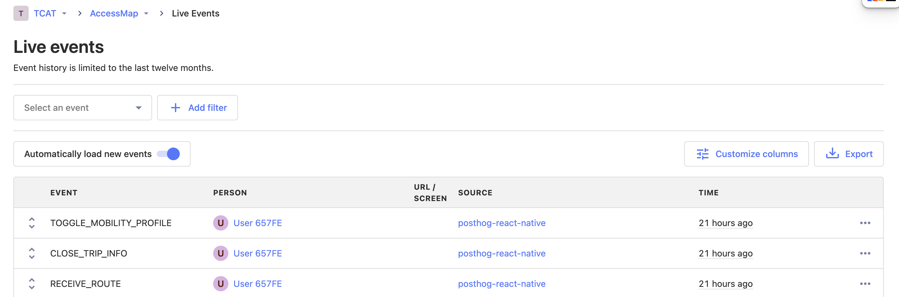

# PostHog User Analytics
As a replacement for Rakam applicable to both iOS and Android, we are currently
also using PostHog to capture user activity within accessmap.

The PostHog API key should always be stored under the untracked secrets.js file.
For access to the currently used instance of PostHog, contact jialn166@gmail.com, kcmtcat@gmail.com, or request access to the TCAT organization. See `src/utils/posthog-config.js` for how we configured the PostHog connection.

## Viewing Events
Every time a user takes some kind of action (that we specifically record), it will show up in https://app.posthog.com/events.
To inspect the exact recorded JSON expand the row on the left to see the 'Properties' and 'JSON' tabs.

