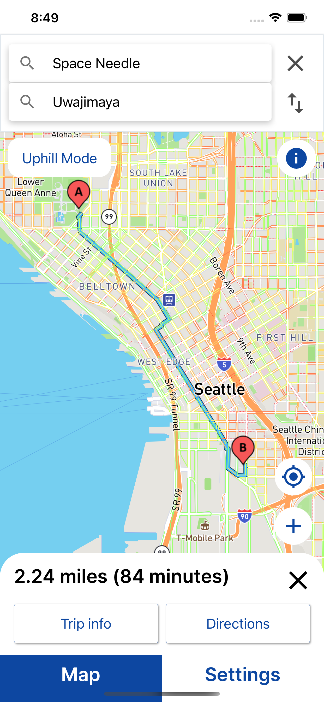
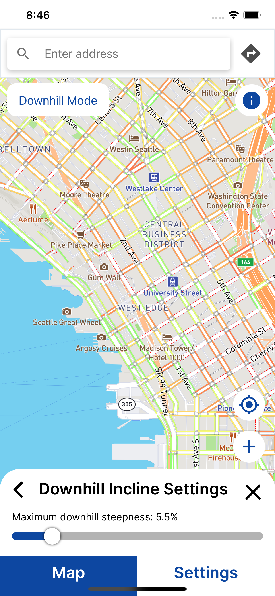

# User Guide
## How to use the Map?
- Touch the map with one finger to pan around to browse the local area. 
- Pinch with two fingers in and out or use the **plus/minus button** on the bottom right to zoom in/out. 
- The **target button** on the bottom right repositions the map view to your current location.
- To give the app permission to use your device's location services, please accept the prompt that shows up after tapping the button.

## How to Plan a Route?
- Click on any part of the map and a white box will appear on the bottom. In the dialog box, choose to "Route from Here" to set it as your starting point and vice versa.
 

- You may also search for locations using the search bar on the top white card.
- After setting a starting and destination point, a card showing the route distance and estimated time it will take
will show up on the bottom. 
  - Click the **Trip Info button** to see a graph showing the elevation gain over the course of your trip as well as the distance, time, and uphill/downhill inclines.
  - Click the **Directions button** to see a list of specific steps to follow from the starting location to your destination.
  
## How to Adjust my Mobility Profile?
- On the map page, tap on the Mobility Profile button on the bottom right.
- Here, you can adjust the maximum tolerated uphill and downhill steepness percentages that will be considered during a route.
- You can also toggle AVOID_BARRIERS (if the route should avoid uncut curbs). 

## How to View App Settings?
- Click on the rightmost tab labeled 'Settings' at the bottom of the screen
- Adjust the language, region, and privacy settings
  - By clicking Agree after seeing the popup after you turn on User Tracking, the app will begin to track the timestamp of your
    actions within the app, such as how often you click the zoom button on the map. It will not collect or link sensitive identifying information such as IP address or account name to the data.
  - Our Privacy Policy is located under the 'Privacy' section, and can also be visible here: https://tinyurl.com/42f7hknz 